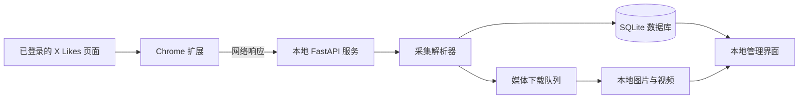

# 系统架构

## 架构目标

系统采用单机、本地优先架构。浏览器扩展只负责从用户当前可访问的 X Likes 页面取得响应并传给本地服务；解析、去重、持久化、媒体下载和浏览全部在本机完成。

## 组件

### Chrome 扩展

`extension/` 是 Manifest V3 扩展，使用 `activeTab`、`debugger`、`scripting` 和 `storage` 权限。扩展只接受当前的 `x.com` 或 `twitter.com` Likes 标签页，通过 Chrome 调试协议观察网络响应、滚动页面并向本地服务提交数据。

### 本地服务

`src/local_favorites_archive/web.py` 创建 FastAPI 应用，默认仅监听 `127.0.0.1:8765`。它提供本地页面、推文查询、统计、标签、设置、删除、数据接收和同步状态接口。

### 采集解析器

`collector.py` 从 X 返回的嵌套数据中提取推文、作者、正文、发布时间、链接和媒体候选项。解析器必须容忍无关指令和字段缺失，但不能把无法确认的对象伪造成推文。

### 持久化层

`storage.py` 负责 SQLite 表结构、事务、查询、去重、标签和受控文件删除。所有传入文件路径必须限制在归档根目录内。

### 媒体下载器

`downloader.py` 下载排队中的图片和视频，默认并发数为 2。下载结果、文件大小、校验值和失败原因写回数据库，以便断点重试和进度显示。

### 本地界面

`static/` 中的 HTML、CSS 和 JavaScript 构成无独立构建步骤的本地管理界面。界面通过 `/api/` 与同源服务通信，不直接读取 SQLite 或归档文件系统。

## 数据流

1. 用户在已登录目标账号的 Chrome 中打开 Likes 页面并启动扩展。
2. 扩展建立一次同步会话，将捕获到的候选响应发送至 `/api/ingest/x-response`。
3. 解析器生成以推文 ID 为主键的结构化记录。
4. 存储层写入新推文，更新已存在记录的最后发现时间，并为新媒体建立下载任务。
5. 媒体下载器将成功内容写入 `archive/media/`，并更新数据库状态。
6. 管理界面从查询、统计和同步状态接口读取本地数据。

## 接口边界

媒体显式重试使用 `POST /api/sync/failures/retry` 处理全部失败媒体，使用 `POST /api/sync/failures/{post_id}/{media_index}/retry` 处理单条失败媒体。Web 层通过下载锁和 `retrying` 状态与同步任务互斥，后台只把仍为 `failed` 的目标认领为 `queued`，完成后刷新统计和失败列表。

- `/api/posts`、`/api/posts/count` 和 `/api/posts/{post_id}`：查询归档内容。
- `/api/stats/overview`：总览统计。
- `/api/tags` 及推文标签子资源：本地标签管理。
- `/api/settings`：归档级同步设置。
- `/api/ingest/start`、`/api/ingest/x-response`、`/api/ingest/finish`：同步会话。
- `/api/sync/status` 和 `/api/sync/failures`：进度与失败信息。
- `/media/{post_id}/{filename}`：受归档根目录约束的本地媒体读取。

接口仅设计给本机界面和扩展使用，不是公开互联网 API。默认监听地址不得改为 `0.0.0.0`，除非另行设计认证和访问控制。

## 数据一致性

- SQLite 外键在每个连接中启用。
- 推文写入以 `post_id` 去重。
- 媒体以 `(post_id, media_index)` 唯一定位。
- 标签名称使用不区分大小写的唯一约束。
- 删除推文时先删除数据库关联，再清理经过归档根目录校验的文件路径。
- 原始响应、数据库记录和媒体状态允许分阶段完成；失败状态必须可检查和重试。

## 错误处理

- 扩展无法连接本地服务时应显示可操作的连接提示。
- 无法识别的 X 响应不应终止整个同步会话。
- 媒体下载失败应保留推文及失败原因，不回滚已保存的正文。
- 标签或删除请求失败时，界面不得先行移除本地可见内容。
- 任何越出归档根目录的文件路径都必须拒绝。

## 启动与关闭

`local-favorites init` 创建目录和数据库结构；`local-favorites serve` 初始化后启动 Web 服务；`local-favorites retry-media` 对未完成媒体执行重试。备份、移动或彻底清空归档前必须停止服务，避免 SQLite 和下载器继续写入。

收藏查询使用 `tag_ids` 与 `tag_mode` 生成交集或并集条件。扩展的 DOM 补采通过 `/api/ingest/dom-posts` 进入与 GraphQL 相同的入库状态机。`--lan` 将服务绑定到 `0.0.0.0`，但扩展仍调用回环地址。
